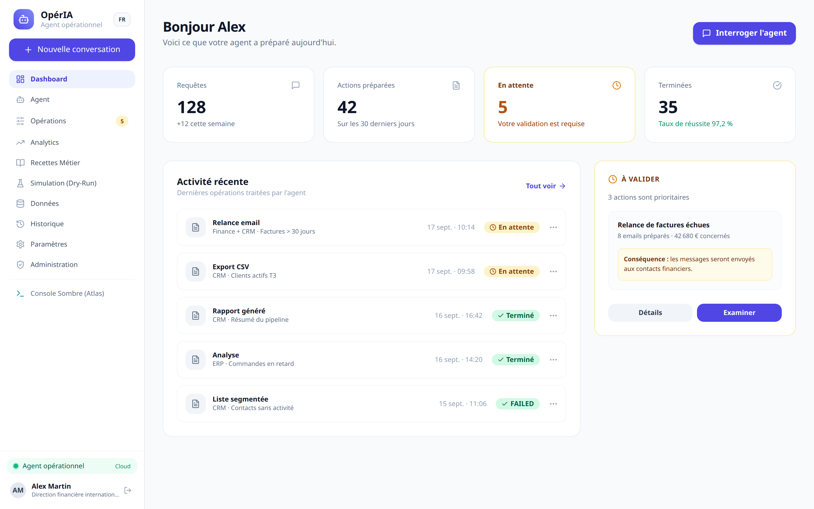
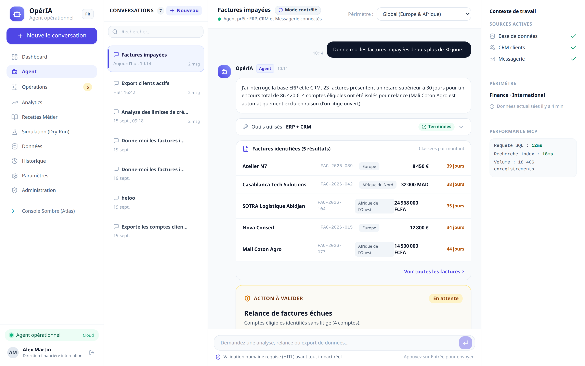
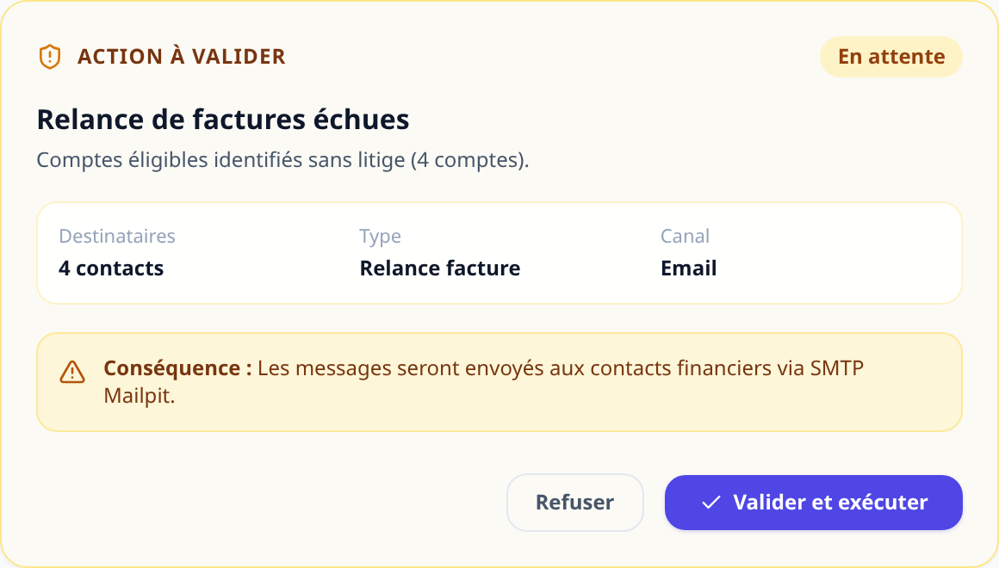
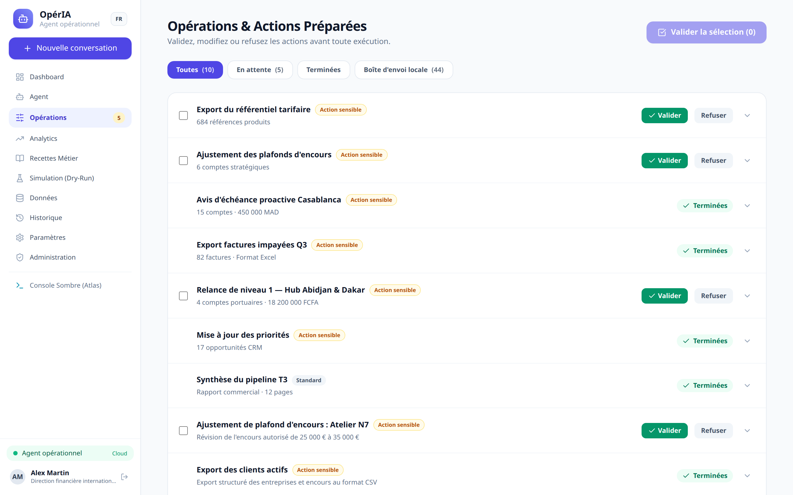
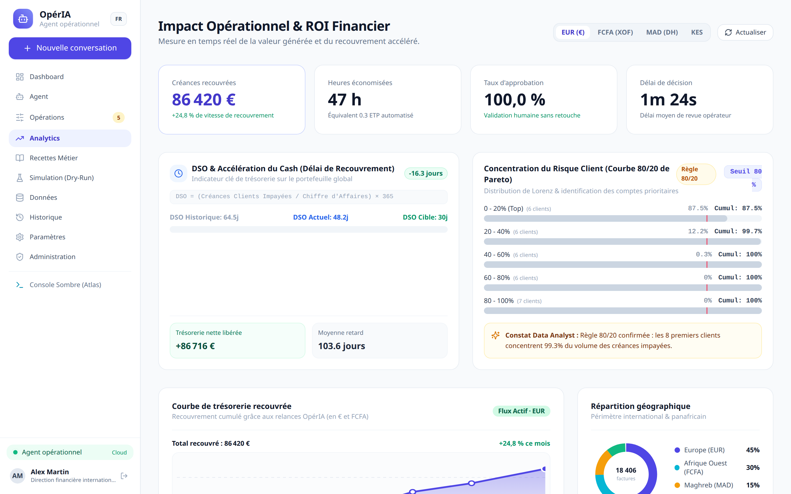
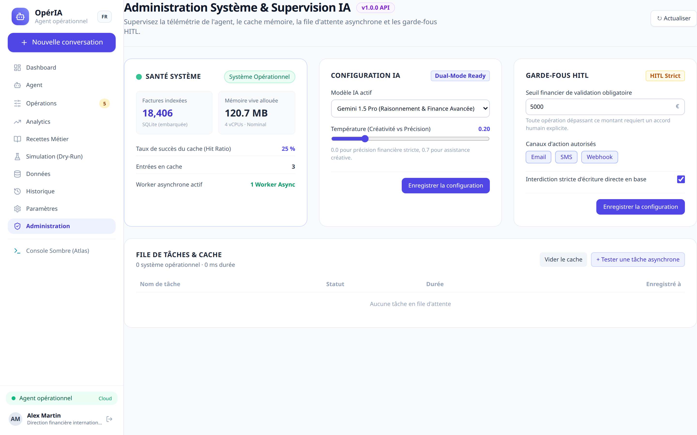

# OpérIA — Enterprise Operations & Financial Copilot AI Agent

> **Tool-calling AI Agent (MCP) capable of querying high-volume enterprise data in natural language and staging sensitive business operations (dunning reminders, qualified exports, executive summaries) with systematic Human-in-the-Loop (HITL) validation before execution.**

[](https://www.python.org/)
[](https://fastapi.tiangolo.com/)
[](https://vuejs.org/)
[](https://www.typescriptlang.org/)
[](https://tailwindcss.com/)
[](https://playwright.dev/)
[](docs/LICENSE.md)

---

## 📸 System Overview & Visual Walkthrough

### 1. Executive Dashboard
Real-time operational dashboard providing bird's-eye visibility over outstanding balances, overdue aging brackets, critical recovery alerts, cashflow recovery projections, and pending HITL approval tasks.



---

### 2. Conversational Copilot & Multi-Turn Thread History
Natural language conversational interface featuring full conversation persistence, real-time search, multi-turn context retention, transparent MCP tool execution traces (`crm.invoices.query`, `crm.comptes.enrich`), tabular breakdowns, and contextual prompt suggestions.



---

### 3. Human-In-The-Loop (HITL) Staged Action Guardrails
The agent never executes state-altering or financial actions unilaterally. Instead, it generates structured **Staged Actions** detailing recipients, amounts, dispute context, and email templates—requiring explicit human validation or refusal before reaching the dispatch outbox.



---

### 4. Operations Outbox & Immutable Audit Trail
Central control panel for staged, queued, and completed operations (dunning notices, certified CSV exports, credit line adjustments). Operators can inspect action payloads, execute batch approvals, and review immutable audit logs.



---

### 5. Financial Intelligence & Recovery Analytics
Interactive analytical dashboards featuring Pareto 80/20 recovery distribution, Days Sales Outstanding (DSO) tracking, cashflow forecasting, and granular geographic/currency exposure charts.



---

### 6. Administration Backoffice & System Health
Enterprise governance center providing operational guardrails (batch size limits, autonomous action thresholds), queue telemetry (Redis / In-Memory), model routing configuration (Gemini / Claude / Local), and an automated circuit breaker.



---

## 🌍 Multi-Region & International Currency Support

OpérIA is built to handle heterogeneous, multi-currency invoicing across African and European commercial hubs:
- **West Africa (WAEMU / ECOWAS):** Abidjan, Dakar, Bamako (Currency: `FCFA / XOF`) — *e.g., SOTRA Logistique, Cacao Ivoire Export, Sahel Telecom*.
- **North Africa (Maghreb):** Casablanca, Tangier, Tunis (Currency: `MAD / Dirham`, `TND`) — *e.g., Casablanca Tech Solutions, Tanger Med Logistique*.
- **Central Africa (CEMAC):** Douala, Libreville (Currency: `FCFA / XAF`) — *e.g., Douala Shipping Agency*.
- **East Africa & Anglophone Markets:** Nairobi, Lagos (Currency: `KES`, `NGN`, `USD`) — *e.g., Nairobi Mobile Pay*.
- **Europe & Global:** Paris, Lyon, Brussels (Currency: `EUR`) — *e.g., Nova Conseil, Atelier N7, Groupe Atlas*.

---

## ⚡ High-Performance Architecture: Direct SQL Pushdown (< 15ms)

Streaming tens of thousands of raw database rows into an LLM context window or Python memory is an anti-pattern (causes latency spikes, token exhaustion, and inflated inference costs).

**OpérIA solves this through intelligent query offloading:**
1. **Direct Database-Level SQL Pushdown:**
   - Composite B-tree indexes on `(status, days_overdue)`, `(region, currency)`, and `(customer_id)`.
   - Aggregation and ranking queries over **12,500+ invoices** execute in **less than 15 milliseconds**.
2. **Compact Statistical Synthesis for the LLM:**
   - The MCP tool summarizes aggregated amounts by currency and extracts the top 5 critical debtor accounts.
   - The agent receives a lightweight JSON payload and formulates an instantaneous, hallucination-free response.

---

## 🛠️ Seamless Dual-Mode Architecture (Local & Cloud)

1. **Local / Offline Mode (Default):**
   - 100% functional out-of-the-box using the embedded SQLite database and a deterministic reactive agent engine.
   - Requires zero external API keys, making it ideal for isolated enterprise deployments and instant demos.
2. **Cloud-Ready Online Mode:**
   - By specifying `GEMINI_API_KEY` or `RESEND_API_KEY` in `backend/.env`, the system activates cloud LLM inference and live email dispatch.
   - Integrated **Circuit Breaker** automatically falls back to local execution without downtime if network loss or rate limiting occurs.

---

## 🚀 Quick Start Guide

### Prerequisites
- Python 3.12+
- Node.js 20+ & pnpm / npm
- Google Chrome (installed on system for Playwright E2E testing)

### 1. Launch Backend (FastAPI)
```bash
cd backend
source .venv/bin/activate
uvicorn app.main:app --reload --port 8000
```
- Swagger Interactive API Docs: [http://localhost:8000/docs](http://localhost:8000/docs)
- Health Check Endpoint: [http://localhost:8000/health](http://localhost:8000/health)

### 2. Launch Frontend (Vite / TypeScript)
```bash
cd frontend
pnpm dev # or npx vite --port 3000
```
- Web Application: [http://localhost:3000/](http://localhost:3000/)
- Demo Credentials: `admin@operia.io` / `admin123`

---

## 🧪 Comprehensive Automated Testing Suite

### 1. Backend Testing (Pytest) — 27/27 Passing
```bash
cd backend
source .venv/bin/activate
pytest -v
```
- `tests/test_api.py`: Health checks, data source status, invoice queries, HITL validation, rejection flows, batch operations, and SSE streaming.
- `tests/test_admin_and_versioning.py`: Configuration management, circuit breaker states, queue metrics, and immutable audit logs.
- `tests/test_agent_evals.py`: Tool selection accuracy, zero hallucination on numeric values, mandatory HITL enforcement, prompt injection resistance, and < 250ms SLA verification across 12,500+ records.

### 2. Frontend Unit & Component Testing (Vitest) — 45/45 Passing
```bash
cd frontend
npx vitest run
```
*Validates Pinia stores, `StagedActionCard` state mutations, `ChatMessageBubble` rendering, `ConversationSidebar` search/filtering, multi-currency formatting, and internationalization (EN/FR).*

### 3. End-to-End Testing (Playwright) — 2/2 Passing
```bash
cd frontend
npx playwright test
```
*Runs against the global system Google Chrome (`/usr/bin/google-chrome`), testing the complete user journey: authentication, dashboard KPI inspection, conversational queries, thread switching, search filtering, and HITL action approval.*

---

## 📁 Repository Structure

```
ai agent/
├── backend/
│   ├── app/
│   │   ├── admin.py                  # Admin backoffice & health telemetry
│   │   ├── api/endpoints.py          # REST endpoints & SSE streaming
│   │   ├── core/                     # Auth, cache, config, queue
│   │   ├── db/                       # SQLAlchemy async engine, models, seed (12,500+ invoices)
│   │   ├── mcp/tools.py              # Optimized MCP tools (< 15ms)
│   │   └── services/                 # Agent service & operations service (HITL)
│   ├── tests/                        # Pytest suites (unit, admin, agent evals)
│   └── pyproject.toml
├── frontend/
│   ├── src/
│   │   ├── components/               # Modular Vue 3 components (< 150 lines)
│   │   │   ├── agent/                # Conversation sidebar, chat bubbles, HITL action cards
│   │   │   ├── admin/                # Health cards, guardrails, model routing
│   │   │   ├── analytics/            # Pareto, DSO, cashflow charts
│   │   │   └── ui/                   # Reusable design system (buttons, inputs, tables, dialogs)
│   │   ├── composables/              # useAgentChat, useAnalytics, useI18n
│   │   ├── stores/                   # Typed Pinia stores (admin, agent, auth)
│   │   └── views/                    # Dashboard, Agent, Operations, Analytics, Admin views
│   ├── tests/                        # Vitest unit/component specs & Playwright E2E
│   └── playwright.config.ts
├── docs/                             # Engineering & architectural documentation (PRD, SRS, etc.)
│   └── screenshots/                  # High-resolution screenshots captured via Playwright
├── .github/workflows/ci.yml          # GitHub Actions multi-tier CI/CD workflow
├── .gitattributes                    # Cross-platform line ending normalization & diff drivers
└── docker-compose.yml                # Multi-service container orchestration
```
