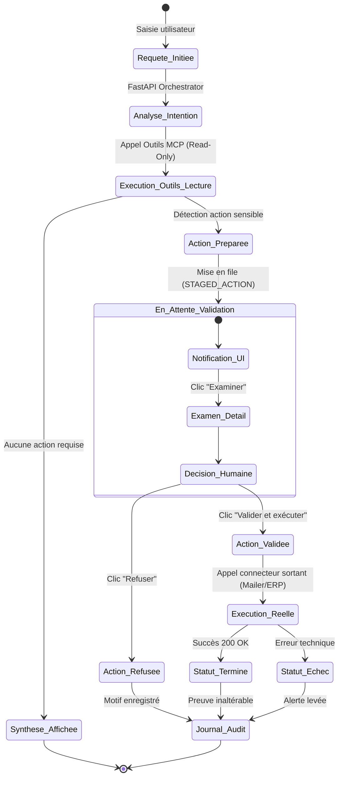
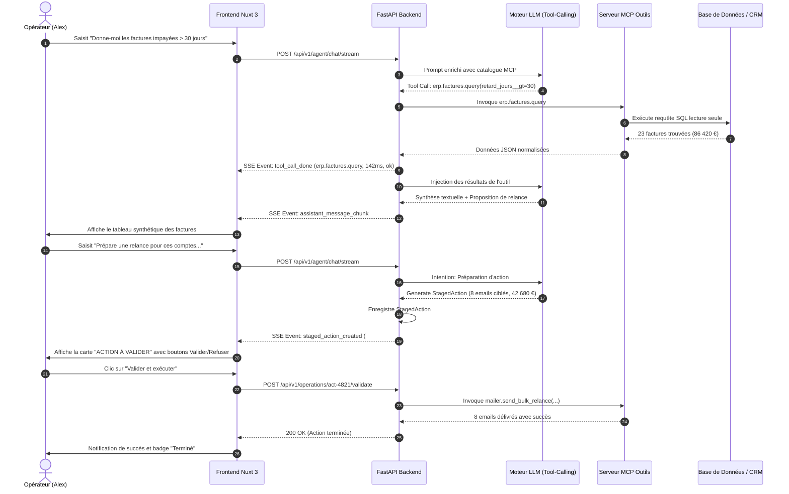
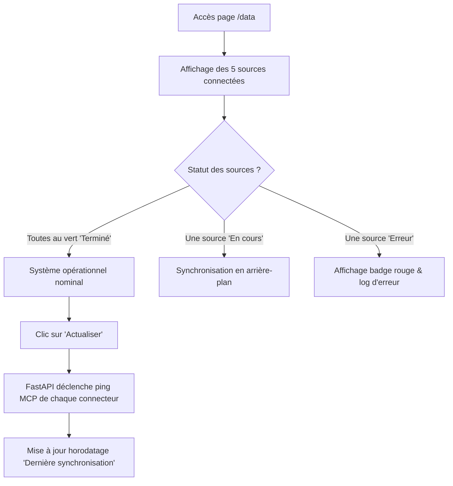

# Parcours Utilisateur & Diagrammes d'États (User Flows) — OpérIA

**Système :** OpérIA (Agent IA d'Opérations Métier)  
**Version :** 1.0.0  
**Date :** 18 Septembre 2026  

---

## 1. Cycle de Vie Global d'une Opération (State Machine)

Toute interaction opérationnelle dans OpérIA suit un cycle de vie strict et audité :

---

## 2. Parcours Détaillés (User Flows)

### Parcours 1 : Interrogation Conversationnelle & Validation dans le Chat (`/agent`)

---

### Parcours 2 : Validation Groupée depuis le Centre des Opérations (`/operations`)

1. **Entrée :** L'utilisateur constate un badge dynamique sur l'onglet de navigation `Opérations [7]`.
2. **Consultation :** Il clique sur l'onglet `Opérations`. L'écran affiche la liste des 7 actions en attente avec leurs critères clés :
   - *Relance de factures échues* (8 emails · 42 680 € · Alex Martin)
   - *Export des clients actifs* (1 248 lignes CSV · Sophie Bernard)
3. **Sélection :** L'utilisateur coche les cases associées aux actions prêtes.
4. **Validation par lot :** Il clique sur le bouton primaire `Valider la sélection`.
5. **Confirmation modale :** Un dialogue de sécurité récapitule :  
   *"Vous êtes sur le point d'exécuter 2 actions sensibles. Voulez-vous continuer ?"*
6. **Exécution :** Après confirmation, les actions basculent en cours puis dans l'onglet `Terminées`. Le compteur du badge passe à `[5]`.

---

### Parcours 3 : Supervision des Sources de Données (`/data`)

---

### Parcours 4 : Configuration des Garde-Fous (`/settings`)

1. L'administrateur ou DAF accède à `/settings`.
2. Le bloc **Contrôle et validations** présente 3 options critiques :
   - [x] *Envoi d'emails externes* (obligatoire par défaut)
   - [x] *Modification de données métier* (obligatoire par défaut)
   - [x] *Export de données clients* (obligatoire par défaut)
3. Si un utilisateur tente de décocher une case, un message d'alerte sécurité requiert son mot de passe et un motif d'audit.
4. Le bloc **Connexions métier** affiche l'état des connecteurs (Base financière, Messagerie) avec un bouton d'accès direct `Configurer`.
