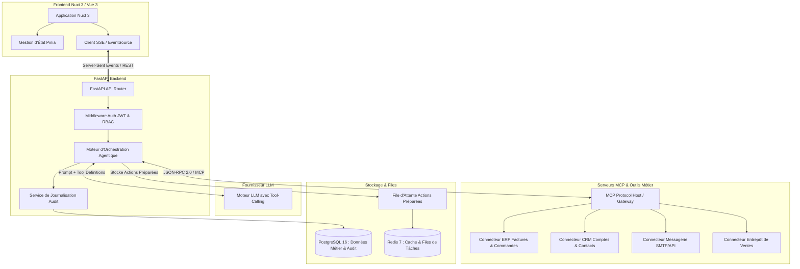

# Architecture Système & Technique (Architecture) — OpérIA

**Système :** OpérIA (Agent IA d'Opérations Métier)  
**Stack Technique :** Python · FastAPI · MCP · Nuxt/Vue · Redis · PostgreSQL  
**Version :** 1.0.0  
**Date :** 18 Septembre 2026  

---

## 1. Vue d'Ensemble de l'Architecture

OpérIA adopte une architecture découplée, orientée services et basée sur le protocole standardisé **MCP (Model Context Protocol)** pour la communication entre le modèle de langage et les systèmes d'information de l'entreprise.

---

## 2. Découpage en Couches Logicielles

### 2.1 Couche Frontend (Nuxt 3 / Vue 3)
- **Framework :** Nuxt 3 en mode hybride (SSR pour l'amorçage rapide, SPA pour les interactions chat réactives).
- **Styling :** Tailwind CSS avec thème violet/indigo d'OpérIA et support natif du mode sombre (Console haute densité Atlas).
- **Gestion d'état :** Pinia (stores : `useAuthStore`, `useChatStore`, `useOperationsStore`, `useDataSourcesStore`).
- **Communication temps réel :** `EventSource` pour les flux de streaming d'inférence et les statuts des outils.

### 2.2 Couche Backend & API (Python / FastAPI)
- **Framework :** FastAPI avec typage strict via Pydantic v2.
- **Orchestrateur Agentique :**
  - Gestionnaire de sessions conversationnelles avec mémoire contextuelle glissante.
  - Parseur de Tool Calls et injection dynamique des contextes MCP.
  - Moteur de politique de sécurité vérifiant la classification `CL-READ` vs `CL-SENSITIVE`.
- **Mécanisme d'interception d'actions :**
  - Si le LLM invoque un outil sensible, l'orchestrateur interrompt le flux d'exécution automatique et matérialise l'intention dans la table `staged_actions`.
  - Émission immédiate d'un événement SSE `staged_action_created` vers le client.

### 2.3 Couche Protocole MCP (Model Context Protocol)
- **Spécification :** Implémentation conforme au standard open-source MCP d'Anthropic.
- **Typologie des connecteurs :**
  1. `mcp-server-erp` : Expose en lecture seule les tables comptables et de commande, et en écriture contrôlée les changements de statut.
  2. `mcp-server-crm` : Enrichit les fiches comptes, contacts, historiques d'échanges.
  3. `mcp-server-messaging` : Prépare et expédie les courriels via API d'entreprise ou SMTP sécurisé (STARTTLS / DKIM).
- **Avantage clé :** Isolation stricte des permissions. Le LLM ne dispose d'aucun identifiant direct sur les bases de données ; il ne manipule que les interfaces MCP strictement définies par contrat JSON Schema.

### 2.4 Couche Données & Asynchronisme
- **PostgreSQL 16 :**
  - Tables relationnelles : `users`, `conversations`, `messages`, `staged_actions`, `audit_logs`, `data_sources`.
- **Redis 7 :**
  - Cache de requêtes fréquentes (TTL 5 minutes).
  - Gestion des verrous distribués (Redlock) pour empêcher les doubles validations simultanées sur une même action.

---

## 3. Flux de Données & Sécurité Réseau

1. **Chiffrement de bout en bout :** Toutes les communications internes et externes sont chiffrées en transit via TLS 1.3.
2. **Isolation des conteneurs :** Les serveurs MCP s'exécutent dans des conteneurs sandboxés avec un profil réseau restreint (aucun accès direct à l'internet public en dehors des passerelles autorisées).
3. **Immuabilité de l'Audit :** Les enregistrements d'audit dans PostgreSQL sont protégés contre les modifications et suppressions (`append-only` avec trigger PostgreSQL bloquant `UPDATE` et `DELETE` sur la table `audit_logs`).
