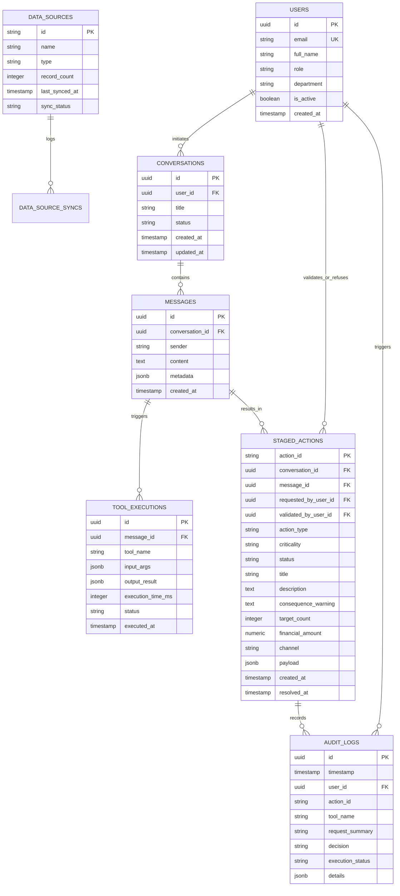

# Modèle de Données & Schémas (Data Model) — OpérIA

**Système :** OpérIA (Agent IA d'Opérations Métier)  
**Base de Données :** PostgreSQL 16  
**ORM / Validation :** SQLAlchemy 2.0 / Pydantic v2  
**Version :** 1.0.0  
**Date :** 18 Septembre 2026  

---

## 1. Diagramme Entité-Association (Entity-Relationship)



---

## 2. Définition des Tables SQL (DDL)

```sql
-- Énumérations
CREATE TYPE user_role AS ENUM ('OPERATOR', 'SUPERVISOR', 'ADMIN');
CREATE TYPE action_criticality AS ENUM ('STANDARD', 'SENSITIVE');
CREATE TYPE action_status AS ENUM ('PENDING', 'APPROVED', 'EXECUTING', 'COMPLETED', 'REFUSED', 'FAILED', 'EXPIRED');
CREATE TYPE tool_status AS ENUM ('OK', 'PARTIAL', 'ERROR');
CREATE TYPE sync_status AS ENUM ('COMPLETED', 'IN_PROGRESS', 'ERROR');

-- 1. Utilisateurs
CREATE TABLE users (
    id UUID PRIMARY KEY DEFAULT gen_random_uuid(),
    email VARCHAR(255) UNIQUE NOT NULL,
    full_name VARCHAR(150) NOT NULL,
    role user_role NOT NULL DEFAULT 'OPERATOR',
    department VARCHAR(100) NOT NULL,
    is_active BOOLEAN NOT NULL DEFAULT TRUE,
    created_at TIMESTAMPTZ NOT NULL DEFAULT NOW()
);

-- 2. Conversations
CREATE TABLE conversations (
    id UUID PRIMARY KEY DEFAULT gen_random_uuid(),
    user_id UUID NOT NULL REFERENCES users(id) ON DELETE CASCADE,
    title VARCHAR(255) NOT NULL,
    status VARCHAR(50) NOT NULL DEFAULT 'active',
    created_at TIMESTAMPTZ NOT NULL DEFAULT NOW(),
    updated_at TIMESTAMPTZ NOT NULL DEFAULT NOW()
);

-- 3. Messages du fil conversationnel
CREATE TABLE messages (
    id UUID PRIMARY KEY DEFAULT gen_random_uuid(),
    conversation_id UUID NOT NULL REFERENCES conversations(id) ON DELETE CASCADE,
    sender VARCHAR(50) NOT NULL, -- 'user', 'assistant', 'system'
    content TEXT NOT NULL,
    metadata JSONB DEFAULT '{}'::jsonb,
    created_at TIMESTAMPTZ NOT NULL DEFAULT NOW()
);

-- 4. Exécutions d'outils MCP
CREATE TABLE tool_executions (
    id UUID PRIMARY KEY DEFAULT gen_random_uuid(),
    message_id UUID NOT NULL REFERENCES messages(id) ON DELETE CASCADE,
    tool_name VARCHAR(100) NOT NULL,
    input_args JSONB NOT NULL,
    output_result JSONB,
    execution_time_ms INTEGER NOT NULL,
    status tool_status NOT NULL DEFAULT 'OK',
    executed_at TIMESTAMPTZ NOT NULL DEFAULT NOW()
);

-- 5. Actions préparées soumises à validation humaine (HITL)
CREATE TABLE staged_actions (
    action_id VARCHAR(50) PRIMARY KEY, -- ex: 'act-4821'
    conversation_id UUID NOT NULL REFERENCES conversations(id) ON DELETE CASCADE,
    message_id UUID REFERENCES messages(id) ON DELETE SET NULL,
    requested_by_user_id UUID NOT NULL REFERENCES users(id),
    validated_by_user_id UUID REFERENCES users(id),
    action_type VARCHAR(50) NOT NULL, -- 'RELANCE_EMAIL', 'EXPORT_CSV', 'REPORT', 'UPDATE_PRIORITY'
    criticality action_criticality NOT NULL DEFAULT 'SENSITIVE',
    status action_status NOT NULL DEFAULT 'PENDING',
    title VARCHAR(255) NOT NULL,
    description TEXT,
    consequence_warning TEXT NOT NULL,
    target_count INTEGER NOT NULL DEFAULT 1,
    financial_amount NUMERIC(14, 2),
    channel VARCHAR(50) NOT NULL DEFAULT 'Email',
    payload JSONB NOT NULL,
    created_at TIMESTAMPTZ NOT NULL DEFAULT NOW(),
    resolved_at TIMESTAMPTZ
);

-- 6. Référentiel des sources métier connectées
CREATE TABLE data_sources (
    id VARCHAR(50) PRIMARY KEY,
    name VARCHAR(100) NOT NULL,
    type VARCHAR(50) NOT NULL, -- 'CRM', 'Base financière', 'ERP', 'Messagerie', 'Référentiel'
    record_count INTEGER NOT NULL DEFAULT 0,
    last_synced_at TIMESTAMPTZ NOT NULL DEFAULT NOW(),
    sync_status sync_status NOT NULL DEFAULT 'COMPLETED'
);

-- 7. Journal d'Audit Immuable
CREATE TABLE audit_logs (
    id UUID PRIMARY KEY DEFAULT gen_random_uuid(),
    timestamp TIMESTAMPTZ NOT NULL DEFAULT NOW(),
    user_id UUID REFERENCES users(id),
    action_id VARCHAR(50),
    tool_name VARCHAR(100),
    request_summary TEXT NOT NULL,
    decision VARCHAR(50), -- 'VALIDATED', 'REFUSED', 'AUTONOMOUS'
    execution_status VARCHAR(50) NOT NULL,
    details JSONB DEFAULT '{}'::jsonb
);

-- Trigger d'immutabilité sur le journal d'audit
CREATE OR REPLACE FUNCTION prevent_audit_tampering()
RETURNS TRIGGER AS $$
BEGIN
    RAISE EXCEPTION 'Les enregistrements de la table audit_logs sont immuables et ne peuvent être ni modifiés ni supprimés.';
END;
$$ LANGUAGE plpgsql;

CREATE TRIGGER audit_logs_immutable
BEFORE UPDATE OR DELETE ON audit_logs
FOR EACH ROW EXECUTE FUNCTION prevent_audit_tampering();
```

---

## 3. Modèles Pydantic v2 (Backend FastAPI)

```python
from pydantic import BaseModel, Field
from typing import Optional, List, Dict, Any
from datetime import datetime
from enum import Enum

class ActionCriticality(str, Enum):
    STANDARD = "STANDARD"
    SENSITIVE = "SENSITIVE"

class ActionStatus(str, Enum):
    PENDING = "PENDING"
    APPROVED = "APPROVED"
    EXECUTING = "EXECUTING"
    COMPLETED = "COMPLETED"
    REFUSED = "REFUSED"
    FAILED = "FAILED"
    EXPIRED = "EXPIRED"

class StagedActionCreate(BaseModel):
    action_type: str
    criticality: ActionCriticality = ActionCriticality.SENSITIVE
    title: str
    description: Optional[str] = None
    consequence_warning: str
    target_count: int = Field(gt=0)
    financial_amount: Optional[float] = None
    channel: str = "Email"
    payload: Dict[str, Any]

class StagedActionResponse(BaseModel):
    action_id: str
    conversation_id: str
    status: ActionStatus
    action_type: str
    criticality: ActionCriticality
    title: str
    description: Optional[str]
    consequence_warning: str
    target_count: int
    financial_amount: Optional[float]
    channel: str
    created_at: datetime
    resolved_at: Optional[datetime]
    requested_by_name: str
```
